# Sinner vs Alcaraz: Bluesky Social Media Analysis (US Open 2025)

[](https://www.python.org/)
[](https://github.com/marshaldb/atproto)
[](https://networkx.org/)
[](https://spacy.io/)
[](report/report.pdf)

> **Web and Social Media Analysis (WSA)**  
> *Academic Project — University of Pavia / University of Milano-Bicocca*  
> 
> **Authors:**  
> * Lorenzo Brusati ([lorenzo.brusati01@universitadipavia.it](mailto:lorenzo.brusati01@universitadipavia.it))  
> * Lorenzo Cinquemani ([lorenzo.cinquemani01@universitadipavia.it](mailto:lorenzo.cinquemani01@universitadipavia.it))  
> * Lorenzo Goatelli ([lorenzo.goatelli01@universitadipavia.it](mailto:lorenzo.goatelli01@universitadipavia.it))  

---

## 📖 Project Overview

This repository contains a full-stack data science pipeline that collects, enriches, models, and visualizes social media discussions from **Bluesky (via the AT Protocol)** during the **US Open 2025** (August 21 to September 10, 2025). The project focuses on the intense rivalry between tennis champions **Jannik Sinner** and **Carlos Alcaraz**. 

By applying **Natural Language Processing (NLP)**, **Social Network Analysis (SNA)**, and **Semi-Supervised Graph Propagation**, the pipeline extracts community structures, profiles public sentiment/emotions, and maps user leaning (stances).

---

## 🗂️ Repository Structure

```
project_root/
├── main.py                          # Pipeline entrypoint: ordered DAG stages (preprocess → network → stance → sentiment)
├── main.ipynb                       # Notebook companion to the pipeline
├── requirements.txt                 # Python environment dependencies
│
├── src/                             # Core analysis modules (one per DAG stage)
│   ├── crawler.py                   # [1] AT Protocol crawler with backoff retries & time-window pagination
│   ├── preprocessing.py             # [2] Enrichment: clean/lemmatize, spaCy NER, DBpedia linking, NRC + GoEmotions(BERT) emotions, RoBERTa sentiment, post/user stance & fanbase
│   ├── social_network_analysis.py   # [3] Graph build, centralities, Louvain + Infomap communities, network plots
│   ├── social_sentiment_analysis.py # [4] Sentiment/emotion visualizations
│   ├── social_stance_analysis.py    # [5] Stance aggregation, polarization, fanbase study, diagnostics
│   └── utils.py                     # Shared constants, model loaders, text/plot helpers
│
├── data/                            # Datasets (populated at runtime)
│   ├── sinner_alcaraz_posts.csv          # Raw crawled posts from Bluesky
│   ├── sinner_alcaraz_processed.csv      # FROZEN NLP/stance-enriched dataset (single source of truth)
│   ├── network_centrality_metrics.csv    # Per-user centrality + community + stance metrics
│   └── network_global_metrics.csv        # Global network statistics
│
├── plots/                           # Visualizations generated by the pipeline
└── report/                          # LaTeX report sources and compiled PDF
    ├── report.tex                   # LaTeX paper detailing project methodology and findings
    └── report.pdf                   # Compiled WSA academic paper
```

---

## ⚙️ System Architecture & Data Flow

The pipeline is a **strict Directed Acyclic Graph (DAG)** of stages. Each stage reads
only the artifact(s) produced by an upstream stage and writes its own; nothing
downstream recomputes what an upstream stage owns. The **preprocessing stage is the
single owner of all enrichment** (cleaning, NER/NED, NRC + GoEmotions(BERT) emotion
scoring, RoBERTa sentiment, post/user stance scoring and the Sinner-vs-Alcaraz fan
distinction). It writes the **frozen** `data/sinner_alcaraz_processed.csv`, which is
the single source of truth — downstream stages only read it.

```mermaid
graph TD
    A[Bluesky API / AT Protocol] -->|Crawler: sinner OR alcaraz| B(src/crawler.py)
    B -->|"[1] Saves Raw CSV"| C[data/sinner_alcaraz_posts.csv]

    C -->|"[2] Preprocess / Enrich"| D(src/preprocessing.py)
    D -->|spaCy NER + DBpedia keyword linking| D1[Entity Recognition & Linking]
    D -->|NRCLex + GoEmotions BERT| D2[Emotion Scoring]
    D -->|CardiffNLP RoBERTa| D3[Sentiment + Post/User Stance & Fanbase]
    D1 & D2 & D3 -->|FROZEN processed CSV| E[data/sinner_alcaraz_processed.csv]

    E -->|"[3] Network"| F(src/social_network_analysis.py)
    F -->|Replies & Mentions| F1[Undirected G & Directed Gd]
    F1 -->|Centrality| F2[Degree, Closeness, Betweenness, PageRank]
    F1 -->|Communities| F3[Louvain + Infomap]
    F2 & F3 --> G[network_centrality_metrics.csv / network_global_metrics.csv / network_*.png]

    E --> H(["[4] src/social_sentiment_analysis.py"])
    G --> H
    H -->|Matplotlib / Seaborn| H1[sentiment_*.png, community_emotion_*.png]

    E --> I(["[5] src/social_stance_analysis.py"])
    G --> I
    I -->|Aggregation + Polarization + Fanbase study| I1[stance_*.png, fanbase_*.png]

    style E fill:#2c3e50,stroke:#1abc9c,stroke-width:2px;
```



Stages [2]–[5] are orchestrated in order by `main.py` (`stage_preprocess` →
`stage_network` → `stage_stance` → `stage_sentiment`); each is independently runnable
when its inputs exist, and the processed-CSV cache is reused if present.

---

## 🛠️ Installation & Environment Setup

The pipeline has been designed to run out-of-the-box, automatically bootstrapping models on its first execution.

### 1. Clone & Navigate to the Repository
```bash
git clone https://github.com/brusati04/bluesky-sinner-alcaraz-analysis.git
cd bluesky-sinner-alcaraz-analysis
```

### 2. Install Required Packages
Using a terminal or Command Prompt, run:
```bash
pip install -r requirements.txt
```

> [!NOTE]
> On the first execution of `main.py`, the pipeline will **automatically check and download** required NLP packages if they are missing (specifically spaCy's `en_core_web_sm` model and NLTK's `stopwords`, `punkt`, and `punkt_tab` resources). 

---

## 🔑 Configure API Credentials (Optional)

The repository includes pre-crawled data (`data/sinner_alcaraz_posts.csv`), allowing you to skip step 1. If you wish to re-run the data collection crawler:

1. Copy `.env.example` to `.env`:
   - **Windows:** `copy .env.example .env`
   - **macOS/Linux:** `cp .env.example .env`
2. Open `.env` and fill in your Bluesky credentials:
   ```env
   BSKY_HANDLE=your-bluesky-handle@domain.com
   BSKY_APP_PASSWORD=your-app-specific-password
   ```
   *(Create an app password via Bluesky Settings -> App Passwords)*

---

## 🚀 Running the Pipeline

### Step 1 — Crawling Bluesky (Optional)
```bash
python src/crawler.py
```
* **What it does:** Crawls posts containing queries for Sinner and Alcaraz, resolving pagination constraints by slicing the query day-by-day. It gracefully backs off (`time.sleep`) on `429 Too Many Requests` API status codes.
* **Output:** `data/sinner_alcaraz_posts.csv`

### Step 2 — Run the Core Analysis
```bash
python main.py
```
* **What it does:** Runs the ordered DAG — preprocessing/enrichment → network analysis → stance analysis → sentiment analysis — outputting results directly.
* **Outputs:** 
  - `data/sinner_alcaraz_processed.csv`
  - `data/network_centrality_metrics.csv` & `data/network_global_metrics.csv`
  - `plots/` & `report/` (comparative PNG plots)

---

## 🧠 Core Methodologies & Features

### 1. NLP Content Enrichment (`src/nlp_analysis.py`)
* **VADER Sentiment Indexing:** Computes positive, negative, and compound scores. Sentiments are binned into categories based on standard baselines: $\ge 0.05$ (Positive), $\le -0.05$ (Negative), and neutral in between.
* **NRC Emotion Lexicon:** Profiles posts across 8 fundamental dimensions: *joy, trust, anticipation, surprise, fear, sadness, anger, and disgust*.
* **spaCy & DBpedia Spotlight Named Entity Linking (NEL):** Identifies Named Entities (NER) and links them to formal DBpedia URIs.
  > [!TIP]
  > **API Resilience:** If DBpedia Spotlight goes down or throttles requests, a built-in **Circuit Breaker** trips, entering a 60-second cooldown phase where the script falls back to local regex-based keyword mappings to keep execution flowing without errors.
* **Kruskal-Wallis Attitudinal Polarization Test:** Validates if community structures exhibit statistically significant sentiment differences (evaluating VADER compound distributions across community members). If the test statistic is high and $p < 0.05$, community boundaries are mathematically proven to represent distinct echo chambers.

### 2. Social Network Analysis & Graph Mining (`src/network_analysis.py`)
* **Network Graph Formulation:** Mentions and replies are parsed to build:
  - Undirected weighted graph $G$: captures overall interaction density.
  - Directed weighted graph $Gd$: models the directional flow of information.
* **Centrality Profiling:** Computes Degree Centrality, Closeness Centrality, and Betweenness Centrality on $G$, plus In-degree, Out-degree, and PageRank (influence prestige) on $Gd$.
* **Community Detection Benchmarking:** Benchmarks five different algorithms:
  1. **Louvain:** Greedy modularity maximization.
  2. **Leiden:** Advanced partition refinement guaranteeing contiguous communities.
  3. **Infomap:** Directed, flow-based community division.
  4. **Label Propagation (LPA):** Fast rule-based neighborhood propagation.
  5. **Fluid Communities:** Constrained density clustering computed strictly on the Giant Connected Component (GCC).
* **Assortativity Coefficient:** Examines degree assortativity and community homophily coefficients to measure network fragmentation.

### 3. Stance Propagation (`src/stance_propagation.py`)
To identify Sinner vs. Alcaraz fans when users don't explicitly state their favorite, we implement an iterative **Laplacian Smoothing / Label Spreading** model.

* **Initial Post Stance:**
  $$s_{\text{post}} = \text{sentiment\_compound} \times (I_{\text{Sinner}} - I_{\text{Alcaraz}})$$
  *Where $I_{\text{Player}} = 1$ if the post references that player, and $0$ otherwise. Mentions of Sinner with positive sentiment score positive, while Alcaraz positive sentiment scores negative.*
* **Initial User Stance ($f^{(0)}$):** Average stance of the user's posts.
* **Iterative Smoothing Formula:**
  $$f^{(t+1)}(i) = \alpha f^{(0)}(i) + (1-\alpha) \sum_{j \in \mathcal{N}(i)} \frac{w_{ij}}{\sum_{k \in \mathcal{N}(i)} w_{ik}} f^{(t)}(j)$$
  *Where $w_{ij}$ is the connection weight between user $i$ and neighbor $j$. The parameter $\alpha = 0.15$ regulates how much users adhere to their original stance vs. adapting to their network.*
* **Convergence & Leaning Classification:** Propagates until differences fall below $\text{tol} = 10^{-5}$. Nodes are classified into:
  - **Sinner Fan:** Stance Score $> 0.05$ (marked Blue in graphs)
  - **Alcaraz Fan:** Stance Score $< -0.05$ (marked Orange in graphs)
  - **Neutral / Undecided:** Otherwise (marked Grey in graphs)

---

## 📊 Visualization Suite (`plots/` & `report/`)

The pipeline generates 13 visualizations representing key results:
* **`network_graph.png`** / **`leiden_network_graph.png`** / **`infomap_network_graph.png`** / **`lpa_network_graph.png`** / **`fluid_network_graph.png`**: Multi-algorithm community layout comparative graphs.
* **`stance_network_graph.png`**: Network visualization color-coded by propagated user stance (Blue vs. Orange vs. Grey).
* **`network_graph_directed.png`**: Directed graph displaying PageRank nodes and interaction paths.
* **`sentiment_distribution.png`**: Bar chart showing overall corpus sentiment slices.
* **`sentiment_over_time.png`**: Rolling average sentiment plotted against actual US Open 2025 event dates (e.g. Finals).
* **`rivalry_comparison.png`**: Bar & line chart comparing player mention volumes vs. average compound sentiment.
* **`emotion_distribution.png`** / **`emotion_rivalry_comparison.png`**: Profiles generated from the NRC Lexicon comparison.
* **`community_sentiment_polarization.png`**: Boxplots charting VADER distributions across communities, highlighting Kruskal-Wallis significance.

---

## 🛠️ Troubleshooting & FAQs

#### ❓ The script fails saying `spacy.load("en_core_web_sm")` failed
The script is programmed to automatically execute `python -m spacy download en_core_web_sm` if the load fails. However, if your environment blocks subprocesses, run this manually:
```bash
python -m spacy download en_core_web_sm
```

#### ❓ Can I run the analysis without setting up a Bluesky account?
**Yes!** The repository comes with a pre-crawled, curated dataset located in `data/sinner_alcaraz_posts.csv`. Running `python main.py` will read this file automatically and run the complete analysis.

#### ❓ The DBpedia Spotlight links are missing or sparse
If the DBpedia API is down or timing out, the pipeline's circuit breaker will activate, falling back to local regex-based mapping. Verify your internet connection or check if [DBpedia Spotlight](https://api.dbpedia-spotlight.org/) is reachable.

---

## 🎓 Academic Course Reference
**WSA Course Website / University Guidelines**  
*M.Sc. in Computer Science / M.Sc. in Data Science*  
Jointly hosted by **University of Pavia** and **University of Milano-Bicocca**.
